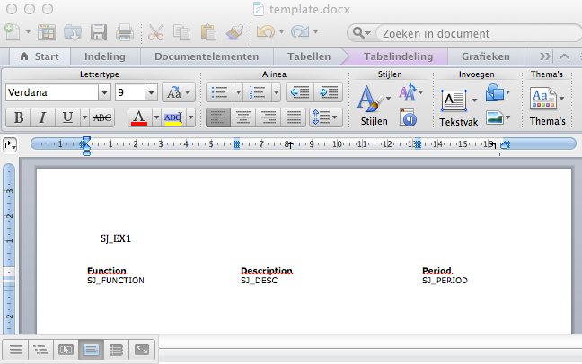
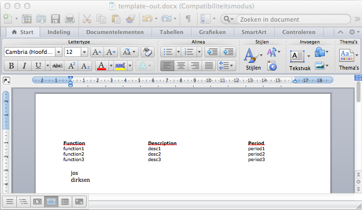

# 使用docx4j编程式地创建复杂的Word(.docx)文档

**一般的方式是首先创建一个包含你最终文档布局和主要样式的word文档,你需要在这个文档中添加用于搜索并替换为真实内容的占位符.**

## 加载一个用于添加内容并保存为新文档的word文档模板




  1. 首先，我们创建一个可用作模版的简单的word文档。对于此只需打开Word，创建新文档然后保存为template.docx，这就是我们将要用于添加内容的word文档。我们需要做的第一件事是使用docx4j将这个文档加载进来.
  
  ```
  private WordprocessingMLPackage getTemplate(String name) throws Docx4JException, FileNotFoundException {
	WordprocessingMLPackage template = WordprocessingMLPackage.load(new FileInputStream(new File(name)));
	return template;
  }
  ```
  
  2. 这样会返回一个表示完整的空白（在此时）文档Java对象。现在我们可以使用Docx4J API添加、删除以及更新这个word文档的内容，Docx4J有一些你可以用于遍历该文档的工具类。我自己写了几个助手方法使查找指定占位符并用真实内容进行替换的操作变地很简单。让我们来看一下其中的一个，这个计算是几个JAXB计算的包装器，允许你针对一个特定的类来搜索指定元素以及它所有的子类元素，例如，你可以用它获取文档中所有的表格、表格中所有的行以及其它类似的操作。
  
  ```
  private static List<Object> getAllElementFromObject(Object obj, Class<?> toSearch) {
	List<Object> result = new ArrayList<Object>();
	if (obj instanceof JAXBElement) obj = ((JAXBElement<?>) obj).getValue();

	if (obj.getClass().equals(toSearch))
		result.add(obj);
	else if (obj instanceof ContentAccessor) {
		List<?> children = ((ContentAccessor) obj).getContent();
		for (Object child : children) {
			result.addAll(getAllElementFromObject(child, toSearch));
		}

	}
	return result;
  }
  ```
  
  3. 在这个例子中我们只是使用不同的值来替换简单的文本占位符，例如你动态设置一个文档的标题。首先，在前面创建的模版文档中添加一个自定义占位符，我使用SJ_EX1作为占位符，我们将要用name参数来替换这个值。在docx4j中基本的文本元素用org.docx4j.wml.Text类来表示，替换这个简单的占位符我们需要做的就是调用这个方法：
  
  ```
  private void replacePlaceholder(WordprocessingMLPackage template, String name, String placeholder ) {
	List<Object> texts = getAllElementFromObject(template.getMainDocumentPart(), Text.class);

	for (Object text : texts) {
		Text textElement = (Text) text;
		if (textElement.getValue().equals(placeholder)) {
			textElement.setValue(name);
		}
	}
  } 
  ```
  
  4. 这会在文档中查找所有的Text元素，并且与占位符匹配的Text都将被我们指定的值替换，现在我们需要做的仅是将这个文档写回一个文件中。 
  
  ```
  private void writeDocxToStream(WordprocessingMLPackage template, String target) throws IOException, Docx4JException {  
    File f = new File(target);  
    template.save(f);  
  }  
  ```
  
## 向模板文档添加段落

  你可能想知道为什么我们需要添加段落？我们已经可以添加文本，难道段落不就是一大段的文本吗？好吧，既是也不是，一个段落确实看起来像是一大段文本，但你需要考虑的是换行符，如果你像前面一样添加一个Text元素并且在文本中添加换行符，它们并不会出现，当你想要换行符时，你就需要创建一个新的段落。然而，幸运的是这对于Docx4j来说也非常地容易。
   
   1. 从模版中找到要替换的段落
   2. 将输入文本拆分成单独的行
   3. 每一行基于模版中的段落创建一个新的段落
   4. 移除原来的段落
	
```
	private void replaceParagraph(String placeholder, String textToAdd, WordprocessingMLPackage template, ContentAccessor addTo) {
	// 1. get the paragraph
	List<Object> paragraphs = getAllElementFromObject(template.getMainDocumentPart(), P.class);

	P toReplace = null;
	for (Object p : paragraphs) {
		List<Object> texts = getAllElementFromObject(p, Text.class);
		for (Object t : texts) {
			Text content = (Text) t;
			if (content.getValue().equals(placeholder)) {
				toReplace = (P) p;
				break;
			}
		}
	}

	// we now have the paragraph that contains our placeholder: toReplace
	// 2. split into seperate lines
	String as[] = StringUtils.splitPreserveAllTokens(textToAdd, '\n');

	for (int i = 0; i < as.length; i++) {
		String ptext = as[i];

		// 3. copy the found paragraph to keep styling correct
		P copy = (P) XmlUtils.deepCopy(toReplace);

		// replace the text elements from the copy
		List<?> texts = getAllElementFromObject(copy, Text.class);
		if (texts.size() > 0) {
			Text textToReplace = (Text) texts.get(0);
			textToReplace.setValue(ptext);
		}

		// add the paragraph to the document
		addTo.getContent().add(copy);
	}

	// 4. remove the original one
	((ContentAccessor)toReplace.getParent()).getContent().remove(toReplace);
    }
```
	
	在这个方法中我们使用提供的文本替换了段落的内容，然后将新的段落指定为addTo方法的参数。
	
```
	String placeholder = "SJ_EX1";
	String toAdd = "jos\ndirksen";

	replaceParagraph(placeholder, toAdd, template, template.getMainDocumentPart());
```
	
	
  如果你用更多的内容针对模版文档运行这个例子，你会注意到这些段落出现在你文档的底部。原因是段落被添加回主文档，如果你希望段落被添加到文档的指定位置（你通常会希望如此），你可以将它们包到一个1X1无边框的表格中，这个表格被视为段落的父亲并且新的段落可以添加到那里。

## 在模板文档中添加表格
  
  1. 找到包含其中一个关键字的表格
  2. 复制用作模板的行
  3. 针对每一条数据,向表格添加基于行模板创建的一行
  4. 移除原来的模板行
  
  首先,来看一下我们将要提供怎样的替换数据,对于本例,我们提供了了一个hashmap的集合,其中包含要被替换的占位符名称和替换它的值,同时也提供了可以在表格行中发现的替换符.
  ```
  Map<String,String> repl1 = new HashMap<String, String>();
  repl1.put("SJ_FUNCTION", "function1");
  repl1.put("SJ_DESC", "desc1");
  repl1.put("SJ_PERIOD", "period1");

  Map<String,String> repl2 = new HashMap<String, String>();
  repl2.put("SJ_FUNCTION", "function2");
  repl2.put("SJ_DESC", "desc2");
  repl2.put("SJ_PERIOD", "period2");

  Map<String,String> repl3 = new HashMap<String, String>();
  repl3.put("SJ_FUNCTION", "function3");
  repl3.put("SJ_DESC", "desc3");
  repl3.put("SJ_PERIOD", "period3");

  replaceTable(new String[]{"SJ_FUNCTION","SJ_DESC","SJ_PERIOD"}, Arrays.asList(repl1,repl2,repl3), template);
  ```
  
  replace方法如下
  
  ```
  private void replaceTable(String[] placeholders, List<Map<String, String>> textToAdd,
			WordprocessingMLPackage template) throws Docx4JException, JAXBException {
	List<Object> tables = getAllElementFromObject(template.getMainDocumentPart(), Tbl.class);

	// 1. find the table
	Tbl tempTable = getTemplateTable(tables, placeholders[0]);
	List<Object> rows = getAllElementFromObject(tempTable, Tr.class);

	// first row is header, second row is content
	if (rows.size() == 2) {
		// this is our template row
		Tr templateRow = (Tr) rows.get(1);

		for (Map<String, String> replacements : textToAdd) {
			// 2 and 3 are done in this method
			addRowToTable(tempTable, templateRow, replacements);
		}

		// 4. remove the template row
		tempTable.getContent().remove(templateRow);
	}
  }
  ```
  
  该方法找到表格,获取第一行并且遍历提供的map向表格添加新行,在将其返回之前删除模板行.这个方法用到了两个工具方法:addRowToTable和getTemplateTable
  
  ```
  private Tbl getTemplateTable(List<Object> tables, String templateKey) throws Docx4JException, JAXBException {
	for (Iterator<Object> iterator = tables.iterator(); iterator.hasNext();) {
		Object tbl = iterator.next();
		List<?> textElements = getAllElementFromObject(tbl, Text.class);
		for (Object text : textElements) {
			Text textElement = (Text) text;
			if (textElement.getValue() != null && textElement.getValue().equals(templateKey))
				return (Tbl) tbl;
		}
	}
	return null;
  }
  ```
  
  这个方法查看表格是否含有我们的占位符,如果有,则返回表格.
  
  ```
  private static void addRowToTable(Tbl reviewtable, Tr templateRow, Map<String, String> replacements) {
	Tr workingRow = (Tr) XmlUtils.deepCopy(templateRow);
	List<?> textElements = getAllElementFromObject(workingRow, Text.class);
	for (Object object : textElements) {
		Text text = (Text) object;
		String replacementValue = (String) replacements.get(text.getValue());
		if (replacementValue != null)
			text.setValue(replacementValue);
	}

	reviewtable.getContent().add(workingRow);
  }
  ```
  
  这个方法复制模板并且使用给定的值替换模板行中的站位符,然后这个复制行被添加到表格.
